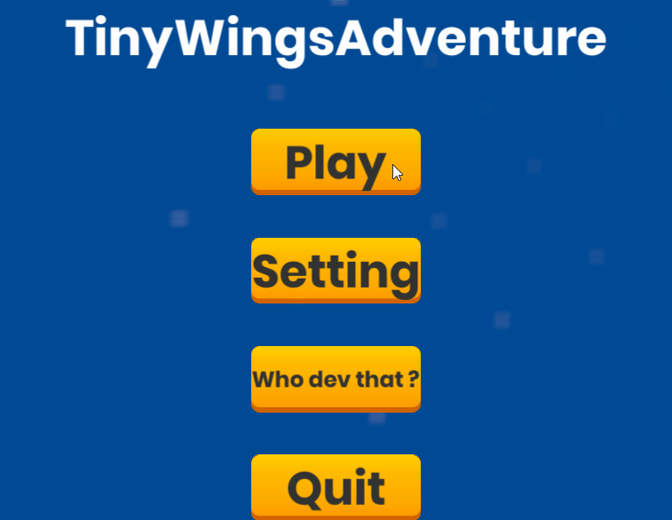
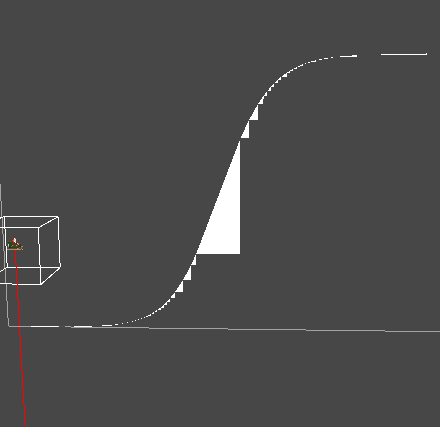

# TinyWingsAdventure

> Game programmers :
> Grondin Jérémy
> Six Jonathan

    

-------------
## Summary
- [Description](##Description "Goto description part")
- [Command](##Command "Goto command part")
- [How to compil](##How-to-compil "Goto compil part")
- [How to launch](##How-to-launch "Goto launch part")
- [Technical aspect](##Technical-aspect "Goto Technical aspect part")
- [Bug](##Bug "Goto bug part")
- [Credit](##Credit "Goto credit part")
- [License](##License "Goto license part")

-----------

## Description
TinyWingsAdventure is a 2D game where is to go as far as possible in limited time (1 minute).

## Command :
### Standalone :
Command       | Action
------------- | -------------
Space         | Add thrust to player
### Mobile :
Command             | Action
-------------       | -------------
1 finger click      | Add thrust to player

## How to compil
### Standalone :
Switch in file/build settings from android to "PC, Mac, Linux Standalone" and clic on build after selected a folder

### Mobile :
Switch in file/build settings from android to "Android" or "iOS" and clic on build after selected a folder

## How to launch
### Standalone :

### Mobile :
After compile of the project and have a .apk file :
Copy the file .apk
Add the file .apk in your phone 
Click in the file .apk
Check if you have a icon for the game in your application
Run it

## Technical aspect :
Use version of unity 2019.4.20f1
It can be found in git repo in github : [link](https://github.com/Renardjojo/TinyWings)

Skybox is generated at hand thanks to cercle algorythm and subdivision.
3 Technical have been implemented to improve shader : 
- The first is to draw function in plane thanks to the algorythm of the function. Each pixel use constant and apply the function like sin, hyperbolic tan, elliptic, polynome... . This technical allow use to have perffect resolution and to have function that fit perfect with screen.

- The second solution was to Create multiple game object to draw only part of the curve wich can fit with line. Thanks to this technical, all function use the same shader, a shader with line.

    

- The third solution was to send all heigth to the shader and use lerp between all these point. This technical allow use to get faster image of the function using the X as index for the buffer.

The first solution looking to produce the best frame rate and is perf to fit with all screen resolution

--------

All physic computing are made from scratch thanks to newtone physics. 4 force is computed : player thrust, gravity, friction and soil reaction. The friction coefficient is serialized in worldGenerator class. All thes force is display in editor thanks to DrawDebugLine function.

---------

The curve radius is implemented and work but is not used for optimization reason. Our alogorythm can disptach a fixed number of point homogenously in the curve. This algorythm use the integrales to compute the density of point thank to radius of curvation.

--------- 

The ground is generat proceduratly thanks to function like sin, hyperbolic tan, elliptic, polynome...

---------

Main classes:
- Function script: Generic class the hold the main methods for the functions. It's derivate class are responsible to send data to the shader.
- Chunk: Contain a function type.
- WorldGenerator: Class that choose a function and a mode (Ascending, Descending) and instantiate a new chunk
- PlayerController: class that hold the player movement logic

## Bug :
### Standalone :

### Mobile :

## Credit
Six Jonathan [linkedin](https://www.linkedin.com/in/jonathan-six-4553611a9/) and Grondin Jérémy [linkedin](https://www.linkedin.com/in/j%C3%A9r%C3%A9my-grondin-349269b2/)

Special thanks to :
- Pavel Dobryakov for it's wonder full blur shader optimized for mobile name's Super-Blur-master (His [github](https://github.com/PavelDoGreat/Super-Blur/blob/master/LICENSE))
See also his [MIT LICENSE](Assets/Super-Blur-master/Super-Blur-master/LICENSE) for details.

## License
If you'd try to sell it on Asset Store, then I'm gonna find you.

See [LICENSE](LICENSE) for details.
